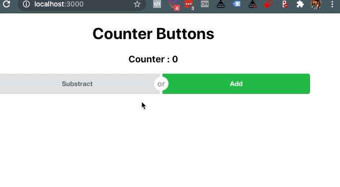

# Belajar React

Dipelajaran kali ini kita belajar tentang redux dengan menggunakan library redux dan react-redux
```
yarn add redux react-redux
```

pada contoh pertama kita membuat simple todo app menggunakan class component filenya ada di

- [./src/ClassComponentApp.js](./src/ClassComponentApp.js)
- [./src/functionsComponentApp.js](./src/functionsComponentApp.js)
- [./reducers/todo.js](./reducers/todo.js)


dan di tugas kita membuat counter filenya ada


Code dapat di akses di...

- [./src/App.js](./src/App.js)
- [./src/App.js](./reducers/counter.js)
